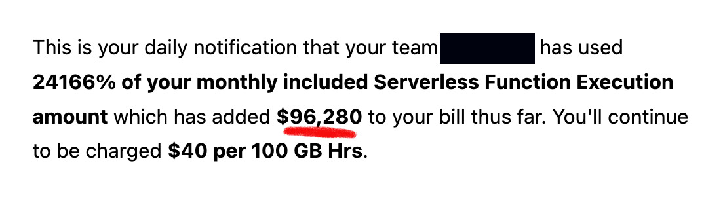
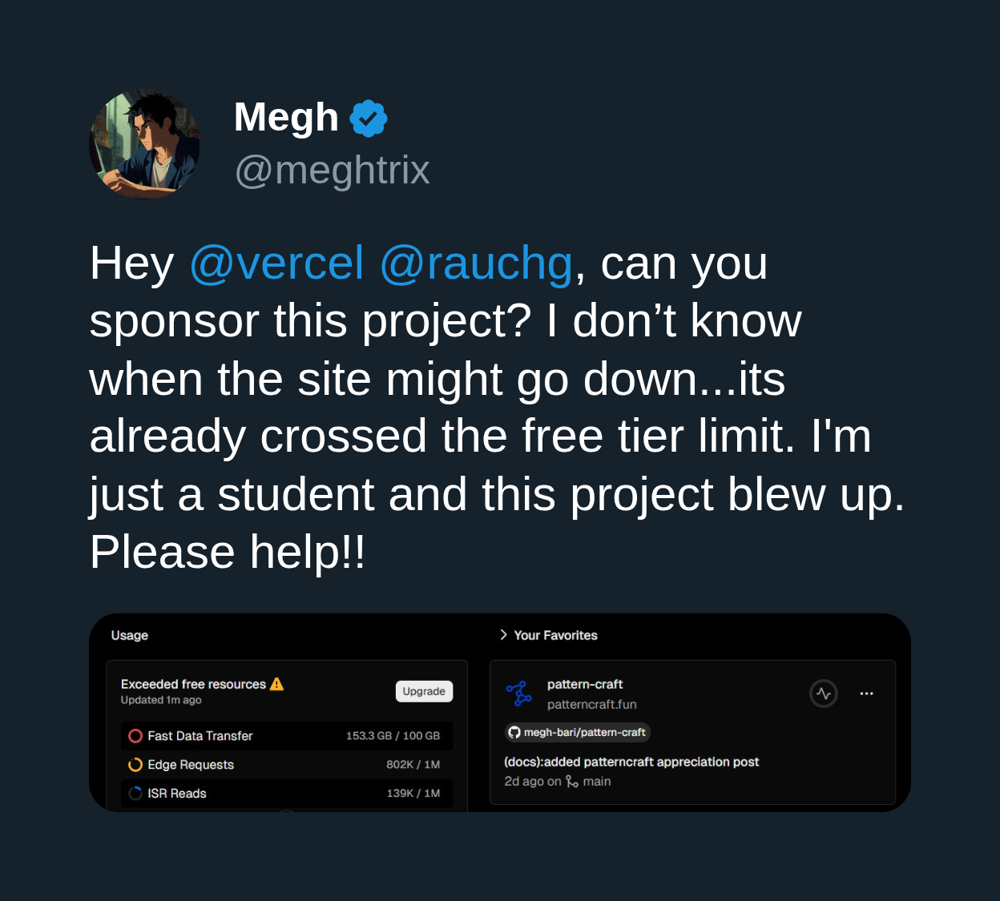

If any of the following fits you:

- You are a student that wants to put your final year project on the internet easily.
- You're doing a prototype and don't want to worry about servers.
- You are simply building a side project and still not ready to be billed for it.

Serverless might be a better fit for you instead of traditional server-based architecture.

I'll discuss how serverless helps in those cases, and some tips to keep your app within free-tiers.

---

{/* START doctoc generated TOC please keep comment here to allow auto update */}
{/* DON'T EDIT THIS SECTION, INSTEAD RE-RUN doctoc TO UPDATE */}
**Table of Contents** {/* generated with [DocToc](https://github.com/thlorenz/doctoc) */}

- [Who's This Article For](#whos-this-article-for)
- [What's Serverless?](#whats-serverless)
- [But Why Serverless?](#but-why-serverless)
- [Tech Stack](#tech-stack)
  - [Next.js (Full-stack Framework)](#nextjs-full-stack-framework)
  - [Hono (API Routing)](#hono-api-routing)
  - [Turborepo (Monorepo)](#turborepo-monorepo)
  - [Neon PostgreSQL (Database)](#neon-postgresql-database)
  - [Cloudflare R2 (Object Storage)](#cloudflare-r2-object-storage)
  - [Netlify (Serverless Platform)](#netlify-serverless-platform)
- [How to Stay within Free Tier](#how-to-stay-within-free-tier)
- [Wrap Up](#wrap-up)
  - [References](#references)

{/* END doctoc generated TOC please keep comment here to allow auto update */}

## Who's This Article For

When I was looking for a job as a student, I struggled to find a place to host my learning projects for free to showcase them. Front-end isn't an issue (in case of SPA, or static websites),
but for back-end, your options are limited, Heroku free tier was too good to be true, which is why it was eventually removed.[[1]](#references),
all other server hosting free-tier options are extremely slow (to be expected),
and as a result all my back-end demos at the time were slow and awkward.
This article is for anyone that is faced with a similar question,
where can I host my personal projects when I can't (or don't want to) pay for them?

Though if the mentioned criteria don't fit you... serverless might still be good choice! but the "free-tier" thing isn't relevant to you anymore.

Now that's cleared, what is even serverless?

## What's Serverless?

I won't go into the details here, as this is not the purpose of this article.

In short, serverless is a way to run your code without having to manage the servers.

If you ever used Vercel, Netlify or any similar service, you've used serverless.

For more in-depth information, check out [[2][3]](#references).

## But Why Serverless?

A couple of months ago, we started [Aleppo Dev Community](https://aleppo.dev),
which, as you can tell from the name, is a community for developers in my city, Aleppo.

We wanted to build a website that can act as a platform for the community to register for meetups and events. ([meetup.com](https://www.meetup.com/) isn't an option)

So I was faced with the following requirements:

- We're very limited on budget, so we want to keep the costs as low as possible.
- The website is not just a static one, it needs a backend with a database.
- It should be performant.

On the bright side, We don't expect a lot of traffic, so we don't have to worry about a [surprise bill](https://x.com/zemotion/status/1798558292681343039).



Thus serverless made the most sense here.

Because of how serverless services work (you're only billed for the compute time while someone is using your app),
most of them come with a free (Hobby) tier that allows you to use their service to a certain limit,
and if you're doing a hobby project, you won't ever hit the limit, unless you become [viral](https://x.com/meghtrix/status/1951896924988252457):



In general, serverless is good when:

- You expect low traffic, or your app has spiky traffic (during events, weekends...etc)
- You don't want to worry about servers and deployments (or you're not experienced enough).
- You don't have a stateful system (real-time connections).

Of course, there are more pros/cons (that you should look into before deciding), but those are the most relevant for your average hobby/learning project.

## Tech Stack

Now that we want to use serverless, we can select technologies based on that.

### Next.js (Full-stack Framework)

While Next.js has its problems [[4][5]](#references), it makes building fullstack serverless apps effortless, with first-class support from quite a few serverless platforms,
so it's pretty good choice, though if your application is a dashboard or a SPA, a simple React app may be a better fit.

Also Next.js has [Route Handlers](https://nextjs.org/docs/app/getting-started/route-handlers-and-middleware#route-handlers) which allows great flexibility in the API layer.

### Hono (API Routing)

The cool thing about Next.js' route handlers is that they allow you to plug in any back-end framework (that has a Next.js adapter) with no additional work, and Hono is one of those frameworks:

[`app/api/[...route]/route.ts`](https://github.com/vercel/hono-nextjs/blob/main/app/api/%5B...route%5D/route.ts)

```ts
import { Hono } from 'hono'
import { handle } from 'hono/vercel'
export const dynamic = 'force-dynamic'

const app = new Hono().basePath('/api')

app.get('/hello', (c) => {
  return c.json({
    message: 'Hello from Hono on Vercel!'
  })
})

app.get('/:wild', (c) => {
  const wild = c.req.param('wild')
  return c.json({
    message: `Hello from Hono on Vercel! You're now on /api/${wild}!`
  })
})

export const GET = handle(app)
```

You also can't go wrong with Hono (it's all just routers anyways), you just need to have some structure in how your organize your code... that brings us to monorepos.

### Turborepo (Monorepo)

Being able to do full-stack in a single app is nice, but things can get out of control if you're not careful with how you organize code,

I prefer having two different npm packages for front-end (`apps/web`) and back-end (`apps/api`), even if they're hosted on the same server,
and monorepos help here, you can do the whole back-end in its own package,
and only import a single entry object into your front-end's `app/api/[...route]/route.ts`:

```ts
import app from "@workspace/api/src/index";
import { handle } from "hono/vercel";

export const runtime = "nodejs";

export const GET = handle(app);
export const POST = handle(app);
export const PUT = handle(app);
export const DELETE = handle(app);
export const PATCH = handle(app);
export const OPTIONS = handle(app);
```

Now we have the convenience of a single application to deploy, without trading off proper structure.

### Neon PostgreSQL (Database)

Managed databases (e.g. RDS) are expensive, so finding a service that have free tier here is a challenge,
however that's not the case for serverless, Neon is one of those serverless platforms that offers a free tier (and their DX is just great).
and it also won't affect your implementation at all (it's just a postgres database URL), you only need to use the Neon adapter, here I'm using drizzle for the ORM:

```ts
import "dotenv/config";
import { drizzle as neonDrizzle } from "drizzle-orm/neon-serverless";
import * as schema from "./schema";

export const db = neonDrizzle(process.env.DB_URL!, {
  schema,
});
```

And that's it, you don't need to change anything else for this to work.

### Cloudflare R2 (Object Storage)

You still need to store files somewhere, R2 [free tier](https://developers.cloudflare.com/r2/pricing/#free-tier) comes with a 10 GB storage, which, in my opinion is more than enough for hobby projects.
They're also cheaper than S3 overall, so if you're not tied to AWS ecosystem you can consider it for production applications too.

Though you need to provide a credit card to access this.

### Netlify (Serverless Platform)

Now that you have the whole stack ready, you need to deploy it somewhere!

Actually, there are many options here. I recently started using Netlify and I'm liking the experience,
you can explore other solutions if Netlify doesn't fit your needs.

The cool thing about those platforms is that they support Next.js out of the box. So the whole deployment setup can be done in minutes.

## How to Stay within Free Tier

Just above I mentioned the guy that went viral and surpassed vercel free tier


Someone inspected the codebase, and found out the following:

> This thread is a perfect example of people throwing solutions without understanding the actual problem.
>
> I looked at the code. This is a static pattern showcase website, fully static with minimal client-side reactivity.
>
> This doesn't need Next.js, SSR, or ISR. It doesn't need a $50/month VPS. It could (and should) be plain HTML/CSS/JS hosted on a static hosting service, or something like an S3 bucket behind a CDN for pennies.
>
> There are a number of massive (8292x5923) PNGs (~5-10MB/ each) for SEO screenshots that users never see. That's over 110MB of data that search engines are repeatedly downloading and you're getting billed for. These should be 1920x1080 max, WebP format.
>
> I've converted them to WebP and the result is a 94.4% reduction in file size. That's 17x less data transfer for something that users never see.
>
> Fix the root cause, not the symptom.

[check the original tweet here](https://x.com/ImSh4yy/status/1952159426669908198)

As you're billed for every resource you use, every API request, every database query, every byte you move over the network counts.
In general following good performance practices will result in saving serverless costs, things like:

- Minimize API requests in landing page (or even eliminate).
- Avoid optimizing images (`<Image/ >` component) for dynamic content, while this is a tradeoff, image optimizing is expensive in computing.
- Only query columns you actually need and only include properties you need in API responses. While this is something you should always do, it makes a big difference here.

## Wrap Up

While making the decision to go serverless might be a big decision, it's not always the case,
for example [aleppo.dev](https://aleppo.dev) while currently is running on Netlify,
I can seamlessly migrate to a server-based architecture with minimum code changes. so if you have a similar application,
migrating to/from serverless might be easier than you think.

The key decisions you need to make are whether Next.js fit your needs or not.
If Hono will work for your team or you need something more opinionated like NestJS.

Also you're not limited to the tech stack mentioned in this article if you want to go serverless.
There are many options available, the choice is up to you and what your project requires.

Check out this repository: [Stack on a budget](https://github.com/255kb/stack-on-a-budget) for a full list of services with great free tiers.

Also for an example of a running app using the stack mentioned in this article, check out: [aleppo-dev-community/aleppo.dev](https://github.com/aleppo-dev-community/aleppo.dev)

### References

1. [Heroku’s Next Chapter](https://www.heroku.com/blog/next-chapter/#focus-on-mission-critical)
1. [What is Serverless?](https://www.cloudflare.com/learning/serverless/what-is-serverless/) - An article by Cloudflare
1. [What is Serverless?](https://www.youtube.com/watch?v=vxJobGtqKVM/) - A video by IBM
1. [Next.js, just why?](https://pilcrowonpaper.com/blog/nextjs-why/)
1. [You should know this before choosing Next.js](https://eduardoboucas.com/posts/2025-03-25-you-should-know-this-before-choosing-nextjs/)
